import LiteYouTube from '@site/src/components/LiteYouTube';

## Introduction

The Playwright VS Code extension brings the power of Playwright Test directly into your editor, allowing you to run, debug, and generate tests with a seamless UI-driven experience. This guide will walk you through setting up the extension and using its core features to supercharge your end-to-end testing workflow.

<LiteYouTube
    id="WvsLGZnHmzw"
    title="Getting Started with Playwright in VS Code"
/>

## Prerequisites

Before you begin, make sure you have the following installed:
- [Node.js](https://nodejs.org/) (LTS version recommended)
- [Visual Studio Code](https://code.visualstudio.com/)

## Getting Started

### Installation & Setup

1.  **Install the Extension**: Open the Extensions view in VS Code (`Ctrl+Shift+X` or `Cmd+Shift+X`) and search for "Playwright". [Install the official extension from Microsoft](https://marketplace.visualstudio.com/items?itemName=ms-playwright.playwright).

1.  **Install Playwright**: Once the extension is installed, open the Command Palette (`Ctrl+Shift+P` or `Cmd+Shift+P`) and run the **Test: Install Playwright** command.

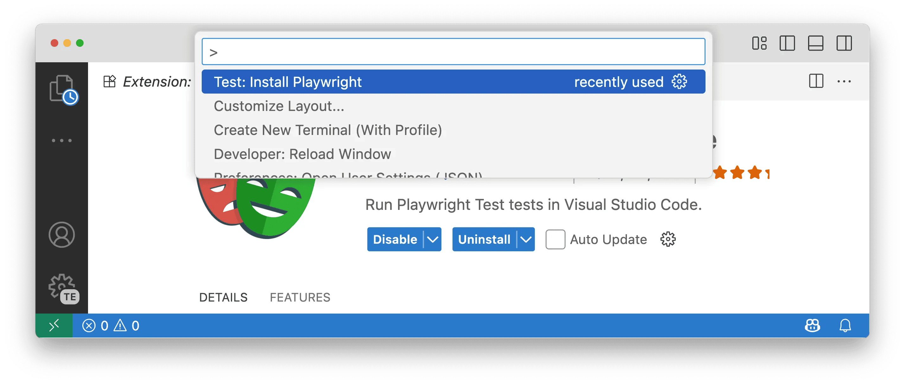

3.  **Select Browsers**: Choose the browsers you want for your tests (e.g., Chromium, Firefox, WebKit). You can also add a GitHub Actions workflow to run tests in CI. These settings can be changed later in your `playwright.config.ts` file.

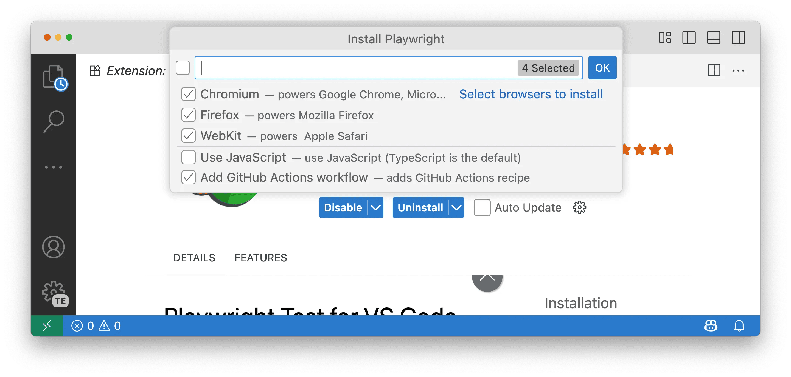

### Opening the Testing Sidebar

Click the **Testing icon** in the VS Code Activity Bar to open the Test Explorer. Here, you'll find your tests, as well as the Playwright sidebar for managing projects, tools, and settings.

## Core Features

### Running Your Tests

<LiteYouTube
    id="mQmcIBMsc38"
    title="Running Playwright Tests in VS Code"
/>

-   **Run a Single Test**: Click the green "play" icon next to any test to run it. The play button will change to a green checkmark if the test passes or a red X if the test fails. You'll be able to see how long the test took to run displayed next to the test name. Additionally, the Test Results panel will automatically open at the bottom of VS Code, showing a summary of the test execution including how many tests ran, how many passed, failed, or were skipped, along with the total execution time.

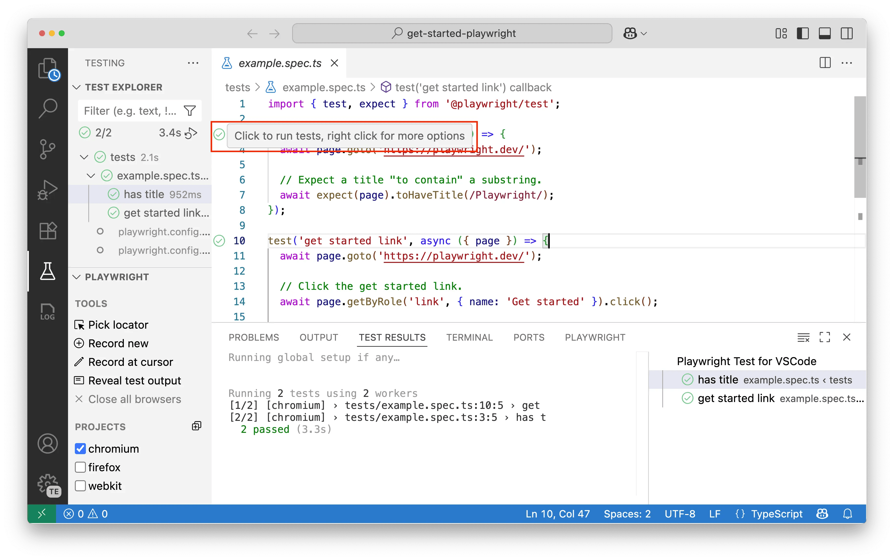

-   **Run All Tests**: You can run all tests at different levels. Click the play icon next to a specific test file to run all tests within that file, or click the play icon at the very top of the Test Explorer to run all tests across your entire project.

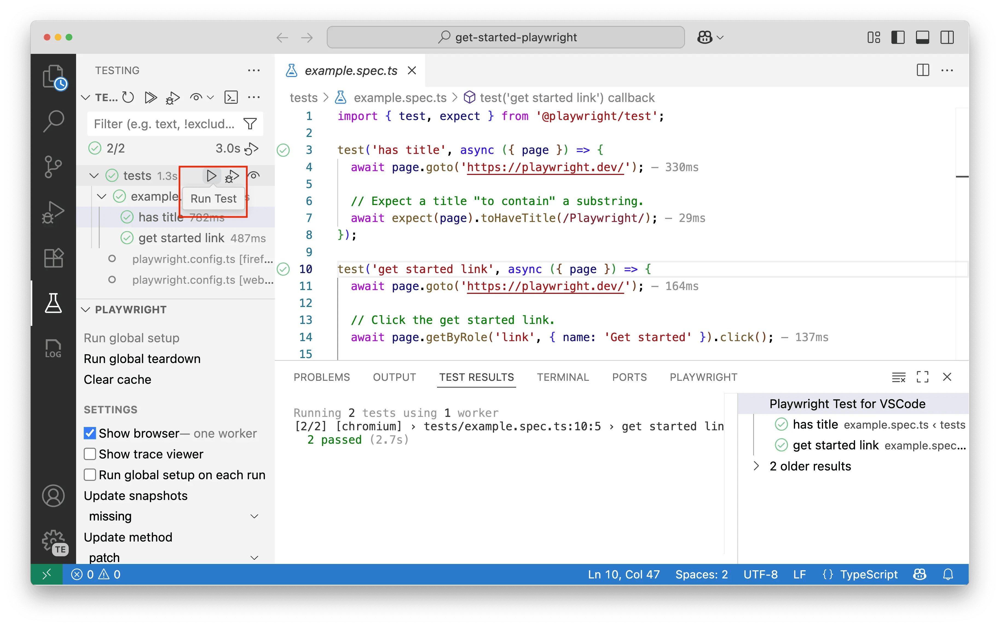

-   **Run on Multiple Browsers**: In the Playwright sidebar, check the boxes for the projects (browsers) you want to test against. Projects in Playwright represent different browser configurations - each project typically corresponds to a specific browser (like Chromium, Firefox, or WebKit) with its own settings such as viewport size, device emulation, or other browser-specific options. When you run a test, it will execute across all selected projects, allowing you to verify your application works consistently across different browsers and configurations.

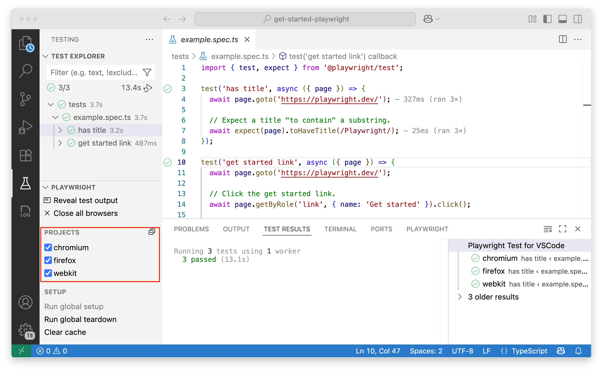

-   **Show Browser**: To watch your tests execute in a live browser window, enable the **Show Browser** option in the sidebar. Disable it to run in headless mode (where tests run in the background without opening a visible browser window).

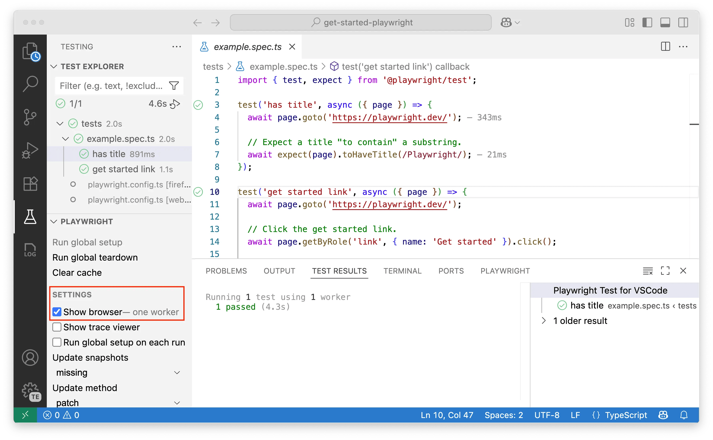

### Debugging Your Tests

<LiteYouTube
    id="tJF7UhA59Gc"
    title="Debugging Playwright tests in VS Code"
/>

The VS Code extension provides powerful debugging tools to help you identify and fix issues in your tests. You can set breakpoints, inspect variables, view detailed error messages, get AI-powered suggestions to resolve test failures, and use the comprehensive trace viewer to analyze test execution step-by-step.

-   **Using Breakpoints**: Set a breakpoint by clicking in the gutter next to a line number. Right-click the test and select **Debug Test**. The test will pause at your breakpoint, allowing you to inspect variables and step through the code.

    

-   **Live Debugging**: With **Show Browsers** enabled, click on a locator in your code. Playwright will highlight the corresponding element in the browser, making it easy to verify locators.

 

-   **Viewing Error Messages**: If a test fails, the extension displays detailed error messages, including the expected vs. received values and a full call log, directly in the editor.

-   **Fix with AI**: When a test fails, click the sparkle icon next to the error to get an AI-powered fix suggestion from Copilot. Copilot analyzes the error and suggests a code change to resolve the issue.

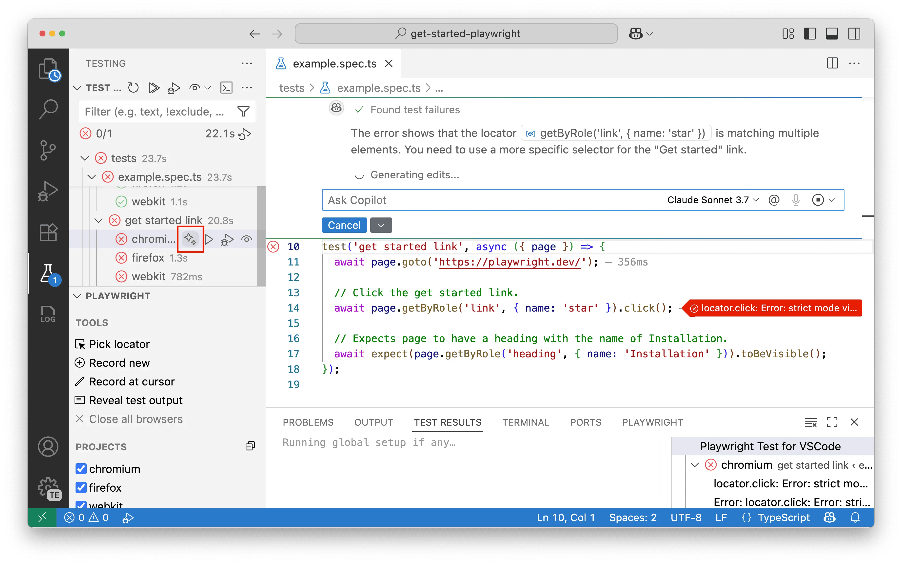

-   **Debugging with Trace Viewer**: For comprehensive debugging, enable the **Show Trace Viewer** option in the Playwright sidebar. When your test finishes, a detailed trace will automatically open, providing you with a complete timeline of your test execution. The trace viewer is particularly useful for:
    - **Step-by-step analysis**: Navigate through each action your test performed with precise timestamps
    - **DOM inspection**: View DOM snapshots at any point during test execution to see exactly what the page looked like
    - **Network monitoring**: Examine all network requests and responses that occurred during the test
    - **Console logs**: Access all console messages and errors from the browser
    - **Source mapping**: Jump directly to the source code that executed each action
    - **Visual debugging**: See screenshots and understand what the user would have seen at each step

    The trace viewer is especially valuable when debugging flaky tests or understanding complex user interactions.

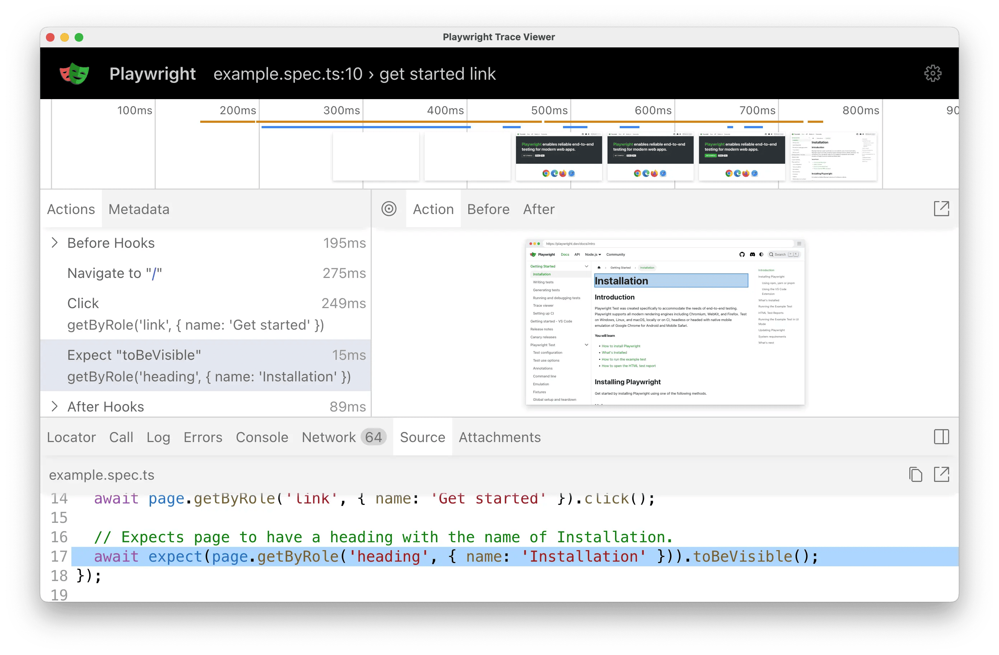

To learn more, see our [Trace Viewer guide](./trace-viewer.md).

### Generating Tests with CodeGen

CodeGen is Playwright's powerful test generation tool that automatically creates test code by recording your interactions with a web page. Instead of writing tests from scratch, you can simply navigate through your application while CodeGen captures your actions and converts them into reliable test code with proper locators and assertions.

<LiteYouTube
    id="5XIZPqKkdBA"
    title="Generating Playwright tests in VS Code"
/>

-   **Record a New Test**: Click **Record new** in the sidebar. A browser window will open. As you interact with the page, Playwright will automatically generate the test code. You can also generate assertions from the recording toolbar.

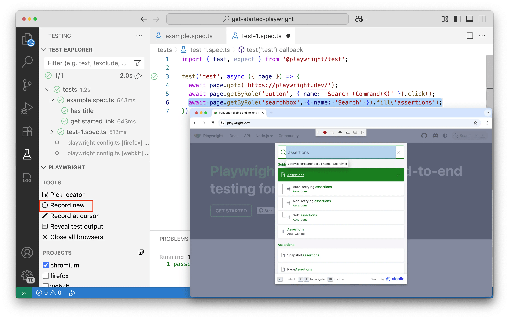

-   **Record at Cursor**: Place your cursor inside an existing test and click **Record at cursor** to add new actions at that specific point.
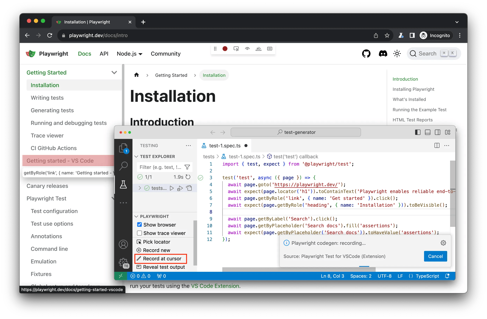

-   **Pick a Locator**: Use the **Pick locator** tool to click on any element in the opened browser. Playwright will determine the best locator and copy it to your clipboard, ready to be pasted into your code.

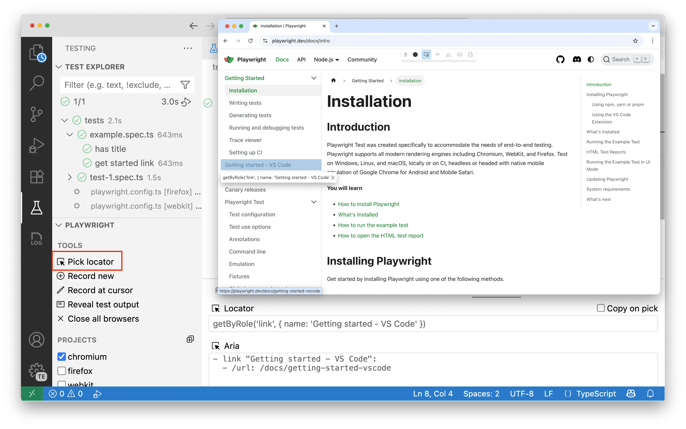

To learn more, see our [CodeGen guide](./codegen.md).

## Advanced Features

### Project Dependencies

Use [project dependencies](./test-projects.md) to define setup tests that run before other tests. For example, you can create a login test that runs first, then reuse that authenticated state across multiple tests without having to log in again for each test. In VS Code, you can see these setup tests in the Test Explorer and run them independently when needed.

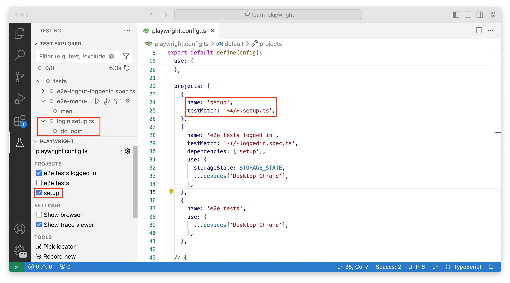

To learn more, see our [Project Dependencies guide](./test-projects.md).

### Global Setup

For tasks that need to run only once before all tests (like seeding a database), use **Global Setup**. You can trigger the global setup and teardown manually from the Playwright sidebar.

### Multiple Configurations

If you have multiple `playwright.config.ts` files, you can switch between them using the gear icon in the Playwright sidebar. This allows you to easily work with different test suites or environments.

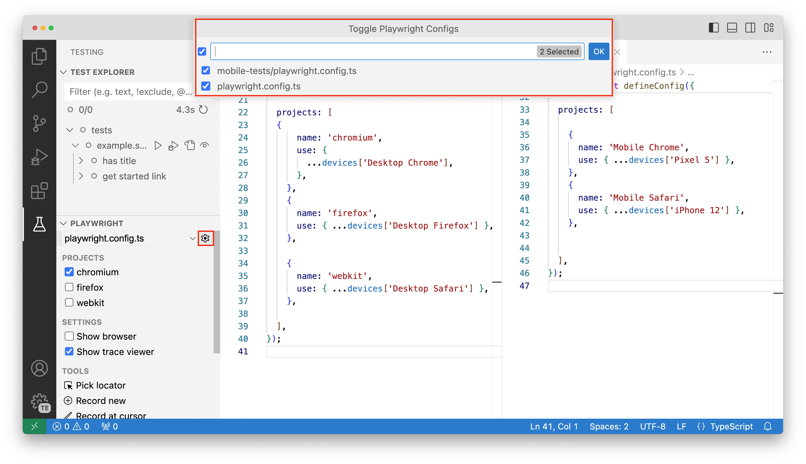

## Quick Reference

| Action                  | How to do it in VS Code                                     |
| ----------------------- | ----------------------------------------------------------- |
| **Install Playwright**  | Command Palette → `Test: Install Playwright`                |
| **Run a Test**          | Click the "play" icon next to the test                      |
| **Debug a Test**        | Set a breakpoint, right-click the test → `Debug Test`       |
| **Show Live Browser**   | Enable `Show Browsers` in the Playwright sidebar            |
| **Record a New Test**   | Click `Record new` in the Playwright sidebar                |
| **Pick a Locator**      | Click `Pick locator` in the Playwright sidebar              |
| **View Test Trace**     | Enable `Show Trace Viewer` in the Playwright sidebar        |

## What's Next

-   [Write tests using web-first assertions, page fixtures, and locators](./writing-tests.md)
-   [Run your tests on CI](./ci-intro.md)
-   [Learn more about the Trace Viewer](./trace-viewer.md)
