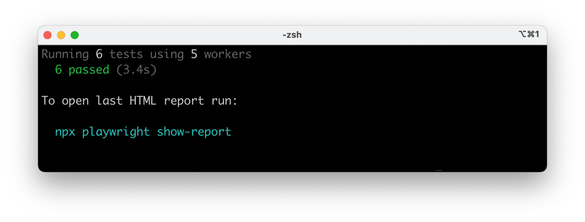
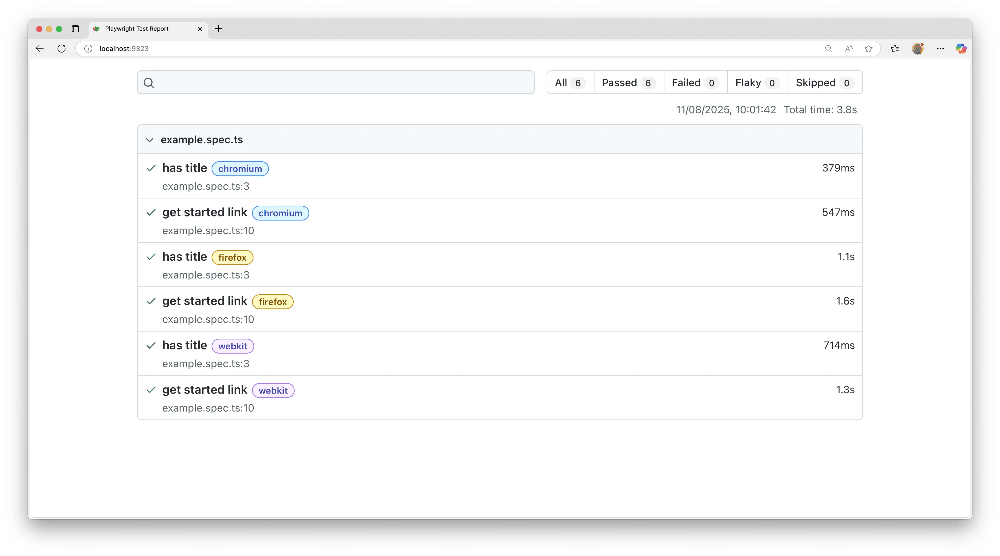

## Introduction

Playwright Test is an end-to-end test framework for modern web apps. It bundles test runner, assertions, isolation, parallelization and rich tooling. Playwright supports Chromium, WebKit and Firefox on Windows, Linux and macOS, locally or in CI, headless or headed, with native mobile emulation for Chrome (Android) and Mobile Safari.

**You will learn**

- [How to install Playwright](/intro.md#installing-playwright)
- [What's installed](/intro.md#whats-installed)
- [How to run the example test](/intro.md#running-the-example-test)
- [How to open the HTML test report](/intro.md#html-test-reports)

## Installing Playwright

Get started by installing Playwright using one of the following methods.

### Using npm, yarn or pnpm

The command below either initializes a new project or adds Playwright to an existing one.

<Tabs
  groupId="js-package-manager"
  defaultValue="npm"
  values={[
    {label: 'npm', value: 'npm'},
    {label: 'yarn', value: 'yarn'},
    {label: 'pnpm', value: 'pnpm'}
  ]
}>
<TabItem value="npm">

```bash
npm init playwright@latest
```

</TabItem>

<TabItem value="yarn">

```bash
yarn create playwright
```

</TabItem>

<TabItem value="pnpm">

```bash
pnpm create playwright
```

</TabItem>

</Tabs>

When prompted, choose / confirm:
- TypeScript or JavaScript (default: TypeScript)
- Tests folder name (default: `tests`, or `e2e` if `tests` already exists)
- Add a GitHub Actions workflow (recommended for CI)
- Install Playwright browsers (default: yes)

You can re-run the command later; it does not overwrite existing tests.

### Using the VS Code Extension

You can also create and run tests with the [VS Code Extension](./getting-started-vscode.md).

## What's Installed

Playwright downloads required browser binaries and creates the scaffold below.

```bash
playwright.config.ts         # Test configuration
package.json
package-lock.json            # Or yarn.lock / pnpm-lock.yaml
tests/
  example.spec.ts            # Minimal example test
```

The [playwright.config](./test-configuration.md) centralizes configuration: target browsers, timeouts, retries, projects, reporters and more. In existing projects dependencies are added to your current `package.json`.

`tests/` contains a minimal starter test.

## Running the Example Test

By default tests run headless in parallel across Chromium, Firefox and WebKit (configurable in [playwright.config](./test-configuration.md)). Output and aggregated results display in the terminal.

<Tabs
  groupId="js-package-manager"
  defaultValue="npm"
  values={[
    {label: 'npm', value: 'npm'},
    {label: 'yarn', value: 'yarn'},
    {label: 'pnpm', value: 'pnpm'}
  ]
}>
<TabItem value="npm">

```bash
npx playwright test
```

</TabItem>

<TabItem value="yarn">

```bash
yarn playwright test
```

</TabItem>

<TabItem value="pnpm">

```bash
pnpm exec playwright test
```

</TabItem>

</Tabs>



Tips:
- See the browser window: add `--headed`.
- Run a single project/browser: `--project=chromium`.
- Run one file: `npx playwright test tests/example.spec.ts`.
- Open testing UI: `--ui`.

See [Running Tests](./running-tests.md) for details on filtering, headed mode, sharding and retries.

## HTML Test Reports

After a test run, the [HTML Reporter](./test-reporters.md#html-reporter) provides a dashboard filterable by the browser, passed, failed, skipped, flaky and more. Click a test to inspect errors, attachments and steps. It auto-opens only when failures occur; open manually with the command below.

<Tabs
  groupId="js-package-manager"
  defaultValue="npm"
  values={[
    {label: 'npm', value: 'npm'},
    {label: 'yarn', value: 'yarn'},
    {label: 'pnpm', value: 'pnpm'}
  ]
}>
<TabItem value="npm">

```bash
npx playwright show-report
```

</TabItem>

<TabItem value="yarn">

```bash
yarn playwright show-report
```

</TabItem>

<TabItem value="pnpm">

```bash
pnpm exec playwright show-report
```

</TabItem>

</Tabs>



## Running the Example Test in UI Mode

Run tests with [UI Mode](./test-ui-mode.md) for watch mode, live step view, time travel debugging and more.

<Tabs
  groupId="js-package-manager"
  defaultValue="npm"
  values={[
    {label: 'npm', value: 'npm'},
    {label: 'yarn', value: 'yarn'},
    {label: 'pnpm', value: 'pnpm'}
  ]
}>

<TabItem value="npm">

```bash
npx playwright test --ui
```

</TabItem>

<TabItem value="yarn">

```bash
yarn playwright test --ui
```

</TabItem>

<TabItem value="pnpm">

```bash
pnpm exec playwright test --ui
```

</TabItem>

</Tabs>


See the [detailed guide on UI Mode](./test-ui-mode.md) for watch filters, step details and trace integration.

## Updating Playwright

Update Playwright and download new browser binaries and their dependencies:

<Tabs
  groupId="js-package-manager"
  defaultValue="npm"
  values={[
    {label: 'npm', value: 'npm'},
    {label: 'yarn', value: 'yarn'},
    {label: 'pnpm', value: 'pnpm'}
  ]
}>

<TabItem value="npm">

```bash
npm install -D @playwright/test@latest
npx playwright install --with-deps
```

</TabItem>

<TabItem value="yarn">

```bash
yarn add --dev @playwright/test@latest
yarn playwright install --with-deps
```

</TabItem>

<TabItem value="pnpm">

```bash
pnpm install --save-dev @playwright/test@latest
pnpm exec playwright install --with-deps
```

</TabItem>

</Tabs>

Check your installed version:

<Tabs
  groupId="js-package-manager"
  defaultValue="npm"
  values={[
    {label: 'npm', value: 'npm'},
    {label: 'yarn', value: 'yarn'},
    {label: 'pnpm', value: 'pnpm'}
  ]
}>

<TabItem value="npm">

```bash
npx playwright --version
```

</TabItem>

<TabItem value="yarn">

```bash
yarn playwright --version
```

</TabItem>

<TabItem value="pnpm">

```bash
pnpm exec playwright --version
```

</TabItem>

</Tabs>

## System requirements

- Node.js: latest 20.x, 22.x or 24.x.
- Windows 11+, Windows Server 2019+ or Windows Subsystem for Linux (WSL).
- macOS 14 (Ventura) or later.
- Debian 12 / 13, Ubuntu 22.04 / 24.04 (x86-64 or arm64).

## What's next

- [Write tests using web-first assertions, fixtures and locators](./writing-tests.md)
- [Run single or multiple tests; headed mode](./running-tests.md)
- [Generate tests with Codegen](./codegen-intro.md)
- [View a trace of your tests](./trace-viewer-intro.md)
