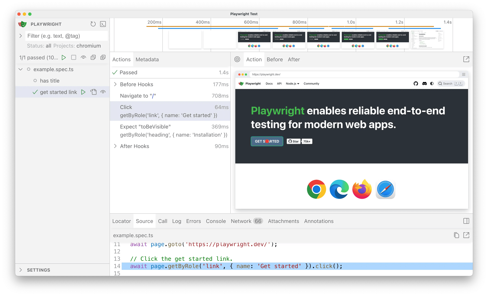
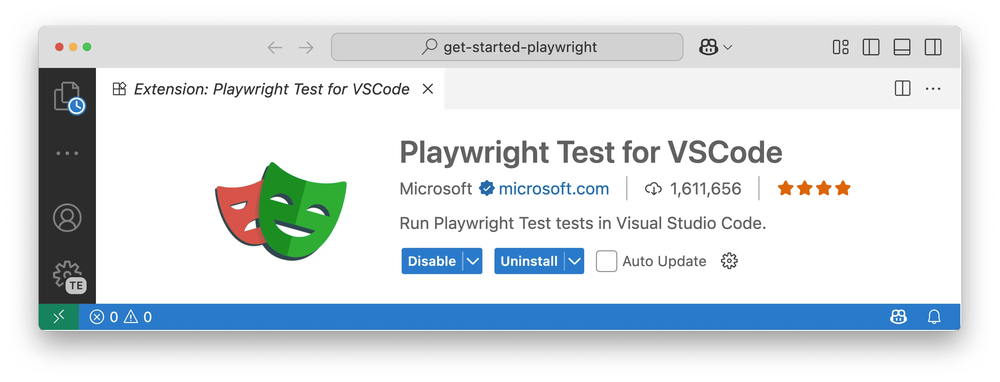
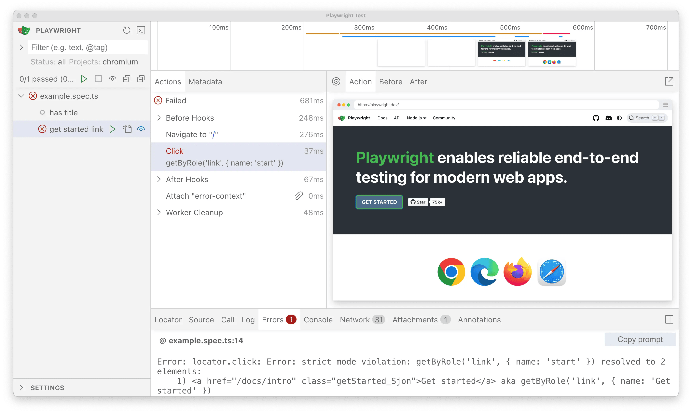
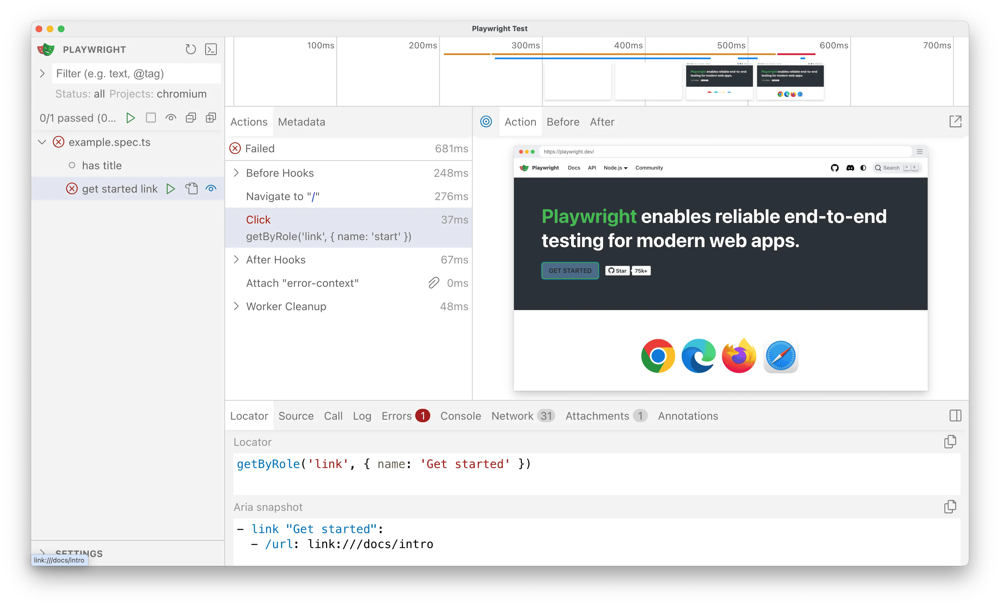
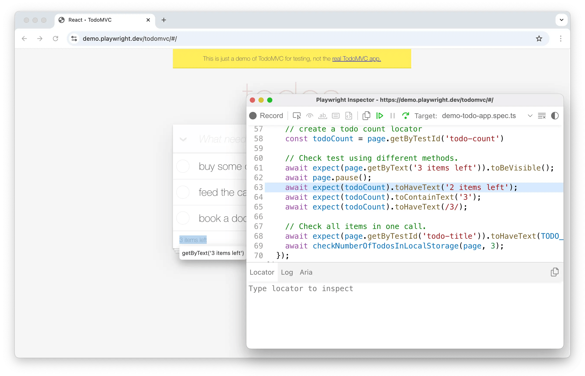
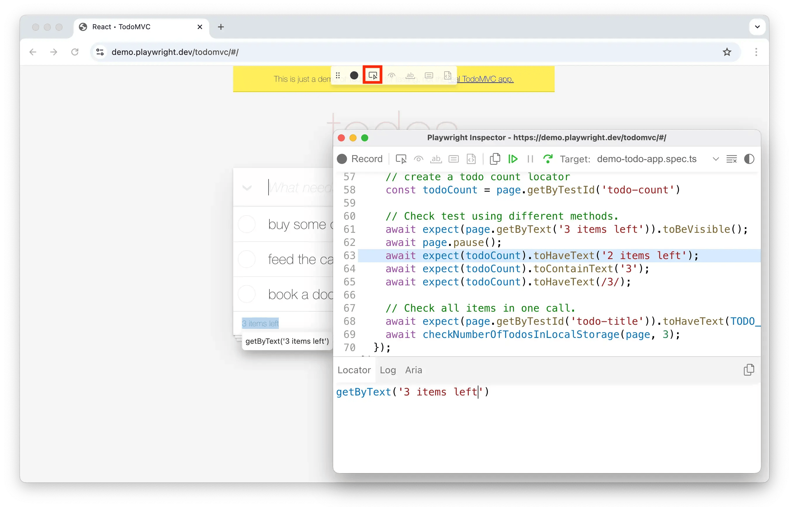
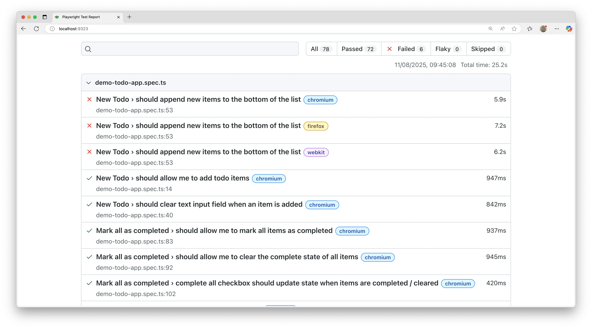
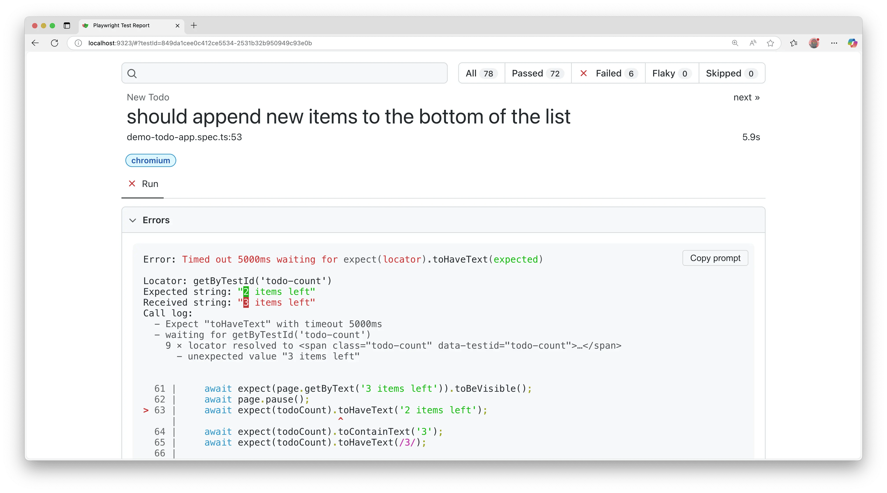

## Introduction

With Playwright you can run a single test, a set of tests, or all tests. Tests can be run on one browser or multiple browsers using the `--project` flag. Tests run in parallel by default and in headless mode, meaning no browser window opens while running the tests and results appear in the terminal. You can run tests in headed mode using the `--headed` CLI argument, or run your tests in [UI mode](./test-ui-mode.md) using the `--ui` flag to see a full trace of your tests.

**You will learn**

- [How to run tests from the command line](/running-tests.md#command-line)
- [How to debug tests](/running-tests.md#debugging-tests)
- [How to open the HTML test reporter](/running-tests.md#test-reports)

## Running tests
### Command line

You can run your tests with the `playwright test` command. This runs your tests on all browsers as configured in the `playwright.config` file, and results appear in the terminal. Tests run in headless mode by default, meaning no browser window opens while running the tests.

```bash
npx playwright test
```


### Run tests in UI mode

We highly recommend running your tests with [UI Mode](./test-ui-mode.md) for a better developer experience where you can easily walk through each step of the test and visually see what was happening before, during and after each step. UI mode also comes with many other features such as the locator picker, watch mode and more.

```bash
npx playwright test --ui
```



Check out our [detailed guide on UI Mode](./test-ui-mode.md) to learn more about its features.

### Run tests in headed mode

To run your tests in headed mode, use the `--headed` flag. This gives you the ability to visually see how Playwright interacts with the website.

```bash
npx playwright test --headed
```

### Run tests on different browsers

To specify which browser you would like to run your tests on, use the `--project` flag followed by the browser name.

```bash
npx playwright test --project webkit
```

To specify multiple browsers to run your tests on, use the `--project` flag multiple times followed by each browser name.

```bash
npx playwright test --project webkit --project firefox
```

### Run specific tests

To run a single test file, pass in the test file name that you want to run.

```bash
npx playwright test landing-page.spec.ts
```

To run a set of test files from different directories, pass in the directory names that you want to run the tests in.

```bash
npx playwright test tests/todo-page/ tests/landing-page/
```

To run files that have `landing` or `login` in the file name, simply pass in these keywords to the CLI.

```bash
npx playwright test landing login
```

To run a test with a specific title, use the `-g` flag followed by the title of the test.

```bash
npx playwright test -g "add a todo item"
```

### Run last failed tests

To run only the tests that failed in the last test run, first run your tests and then run them again with the `--last-failed` flag.

```bash
npx playwright test --last-failed
```


### Run tests in VS Code

Tests can be run right from VS Code using the [VS Code extension](https://marketplace.visualstudio.com/items?itemName=ms-playwright.playwright). Once installed you can simply click the green triangle next to the test you want to run or run all tests from the testing sidebar. Check out our [Getting Started with VS Code](./getting-started-vscode.md) guide for more details.



## Debugging tests

Since Playwright runs in Node.js, you can debug it with your debugger of choice, e.g. using `console.log`, inside your IDE, or directly in VS Code with the [VS Code Extension](./getting-started-vscode.md). Playwright comes with [UI Mode](./test-ui-mode.md), where you can easily walk through each step of the test, see logs, errors, network requests, inspect the DOM snapshot, and more. You can also use the [Playwright Inspector](./debug.md#playwright-inspector), which allows you to step through Playwright API calls, see their debug logs, and explore [locators](./locators.md).

### Debug tests in UI mode

We highly recommend debugging your tests with [UI Mode](./test-ui-mode.md) for a better developer experience where you can easily walk through each step of the test and visually see what was happening before, during, and after each step. UI mode also comes with many other features such as the locator picker, watch mode, and more.

```bash
npx playwright test --ui
```



While debugging you can use the Pick Locator button to select an element on the page and see the locator that Playwright would use to find that element. You can also edit the locator in the locator playground and see it highlighting live in the browser window. Use the Copy Locator button to copy the locator to your clipboard and then paste it into your test.



Check out our [detailed guide on UI Mode](./test-ui-mode.md) to learn more about its features.

### Debug tests with the Playwright Inspector

To debug all tests, run the Playwright test command followed by the `--debug` flag.

```bash
npx playwright test --debug
```



This command opens a browser window as well as the Playwright Inspector. You can use the step over button at the top of the inspector to step through your test. Or, press the play button to run your test from start to finish. Once the test finishes, the browser window closes.

To debug one test file, run the Playwright test command with the test file name that you want to debug followed by the `--debug` flag.

```bash
npx playwright test example.spec.ts --debug
```

To debug a specific test from the line number where the `test(..` is defined, add a colon followed by the line number at the end of the test file name, followed by the `--debug` flag.

```bash
npx playwright test example.spec.ts:10 --debug
```

While debugging you can use the Pick Locator button to select an element on the page and see the locator that Playwright would use to find that element. You can also edit the locator and see it highlighting live in the browser window. Use the Copy Locator button to copy the locator to your clipboard and then paste it into your test.




Check out our [debugging guide](./debug.md) to learn more about debugging with the [VS Code debugger](./debug.md#vs-code-debugger), UI Mode, and the [Playwright Inspector](./debug.md#playwright-inspector) as well as debugging with [Browser Developer tools](./debug.md#browser-developer-tools).


## Test reports

The [HTML Reporter](./test-reporters.md#html-reporter) shows you a full report of your tests allowing you to filter the report by browsers, passed tests, failed tests, skipped tests, and flaky tests. By default, the HTML report opens automatically if some tests failed, otherwise you can open it with the following command.

```bash
npx playwright show-report
```



You can filter and search for tests as well as click on each test to see the test errors and explore each step of the test.




## What's next

- [Generate tests with Codegen](./codegen-intro.md)
- [See a trace of your tests](./trace-viewer-intro.md)
- [Explore all the features of UI Mode](./test-ui-mode.md)
- [Run your tests on CI with GitHub Actions](./ci-intro.md)
